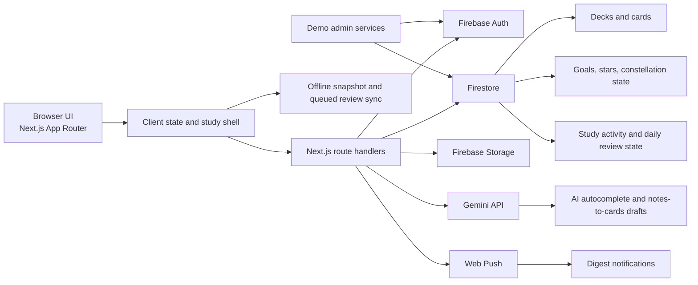

<p align="center">
  
</p>

<h1 align="center">Jami Flashcards</h1>

<p align="center">
  A memory-aware flashcard app with AI-assisted authoring, offline-ready study, actionable analytics, and a constellation reward loop.
</p>

<p align="center">
  <a href="https://jami-jarems421s-projects.vercel.app"><strong>Live app</strong></a>
  ·
  <a href="https://jami-jarems421s-projects.vercel.app/demo"><strong>Public demo</strong></a>
  ·
  <a href="https://github.com/jarems421/jami-flashcards"><strong>Source</strong></a>
</p>

<p align="center">
  <strong>Next.js 16</strong> · <strong>React 19</strong> · <strong>TypeScript</strong> · <strong>Firebase</strong> · <strong>Tailwind CSS</strong> · <strong>Gemini</strong>
</p>

---

## At a glance

Jami is designed to feel like a finished learning product, not just a flashcard CRUD app.

- Build cards quickly with single-card entry, bulk paste, file import, and AI-assisted drafting.
- Study through a memory-aware review flow that combines FSRS scheduling with custom risk ranking.
- Stay productive offline with cached study data and queued review sync.
- See what matters next through retention signals, weak areas, hardest cards, due-load forecasting, and streak pressure.
- Turn progress into something visible with goals, stars, and constellation rewards.

## Live walkthrough

If you open the app from top to bottom, the story is:

1. Start from a polished landing flow with Google sign-in, email sign-in, and a reviewer-friendly public demo.
2. Build a card library through decks, tags, bulk imports, and AI-assisted draft generation.
3. Study through Daily Review for the highest-risk cards or Focused Review for targeted deck/tag practice.
4. Use Insights to understand weak areas, upcoming workload, streak pressure, and hardest cards.
5. Track longer-term progress through goals, stars, and the constellation system.

## Heavy hitters

### 1. Memory-aware study engine

- Daily Review is ranked by memory risk, not just due date order.
- FSRS provides the scheduling base layer.
- A custom risk model pulls in overdue pressure, lapses, and recent struggle history.
- Required and optional review queues keep the session focused without feeling punishing.

### 2. Fast card authoring

- Single-card entry for quick capture.
- Paste-list import for spreadsheet-style workflows.
- Notes-to-cards generation with editable drafts.
- AI card-back autocomplete to speed up writing without auto-committing weak output.
- Export helpers for TSV and CSV deck dumps.

### 3. Useful analytics

- Retention health and due-load summaries.
- Weakest decks, tags, and hardest cards.
- Streak rescue and recent activity changes.
- Coverage and activity metrics that tell the user what to do next, not just what already happened.

### 4. Offline-ready product behavior

- Local snapshots for cards and decks.
- Queued review events while offline.
- Sync-back when connectivity returns.
- PWA and notification foundations already in place.

### 5. Demo and presentation readiness

- Public preview at `/demo`.
- Shared study session for safe hands-on review.
- Demo protections block destructive edits while keeping the review loop accessible.
- Product framing, empty states, and navigation are tuned for interviews, portfolio walkthroughs, and live demos.

## Architecture



## Why it reads well on a CV

- Full-stack learning product built with Next.js 16, React 19, TypeScript, Firebase Auth, Firestore, Storage, and Gemini.
- FSRS spaced repetition extended with a custom memory-risk ranking layer.
- Offline-capable study flow with cached data and deferred sync.
- AI-assisted authoring designed with human review in the loop.
- Analytics, goals, and reward systems connected into one coherent product story.
- Safe public demo and shared study mode for portfolio and interview walkthroughs.
- Unit and rules testing across card utilities, analytics, auth, notifications, demo routes, and Firestore permissions.

## Product map

```text
app/
  api/ai/                AI autocomplete, generation, chat, and explanation routes
  api/demo/              Demo login and refresh routes
  api/notifications/     Digest and notification test routes
  dashboard/             Authenticated product experience
  demo/                  Public product preview
components/
  decks/                 Deck editing, card editing, import, tags, exports
  demo/                  Shared demo entry points
  layout/                App shell, notices, navigation
  stats/                 Analytics presentation
  study/                 Study flow and assistant UI
  ui/                    Shared design system primitives
lib/
  ai/                    Prompting and AI output cleanup
  auth/                  Auth context and listeners
  demo/                  Demo mode helpers
  study/                 Scheduling, analytics, memory risk, offline queue
services/
  ai/                    Client helpers for AI endpoints
  auth/                  Sign-in and account lifecycle helpers
  demo/                  Demo seeding and login services
  firebase/              Client/admin Firebase setup
  notifications/         Push subscription logic
  study/                 Deck, goal, review, and activity services
tests/                   Unit tests and Firestore rules tests
```

## Tech stack

| Area | Tools |
| --- | --- |
| Frontend | Next.js 16, React 19, TypeScript, Tailwind CSS |
| Backend | Firebase Auth, Firestore, Storage, Admin SDK |
| AI | Google Gemini via `@google/generative-ai` |
| Study engine | `ts-fsrs` plus custom memory-risk ranking |
| Charts | Recharts |
| Testing | Vitest, Firebase rules testing |
| Deployment | Vercel |

## Demo mode

- `https://jami-jarems421s-projects.vercel.app/demo` is the public preview.
- The shared study session opens a protected demo account without exposing real credentials.
- On the Hobby Vercel plan, the demo workspace refreshes on access when stale.

## Local setup

### Prerequisites

- Node.js 20+
- A Firebase project with Authentication, Firestore, and Storage enabled
- Gemini API key if you want AI authoring features
- Web Push VAPID keys if you want notifications

### Run locally

```bash
git clone https://github.com/jarems421/jami-flashcards.git
cd jami-flashcards
npm install
cp .env.example .env.local
npm run dev
```

Local app:

```text
http://localhost:3000
```

Environment variables are documented in [`.env.example`](.env.example).

## Useful scripts

| Command | Purpose |
| --- | --- |
| `npm run dev` | Start the local dev server |
| `npm run dev:clean` | Clear `.next` and start fresh |
| `npm run build` | Create a production build |
| `npm run lint` | Run ESLint |
| `npm run typecheck` | Run TypeScript without emitting |
| `npm test` | Run Vitest unit tests |
| `npm run test:rules` | Run Firestore security rule tests in the emulator |
| `npm run firebase:rules:deploy` | Deploy Firestore rules |

## Verification

```bash
npm run typecheck
npm run lint
npm test
npm run build
```

## License

MIT. See [LICENSE](LICENSE).
