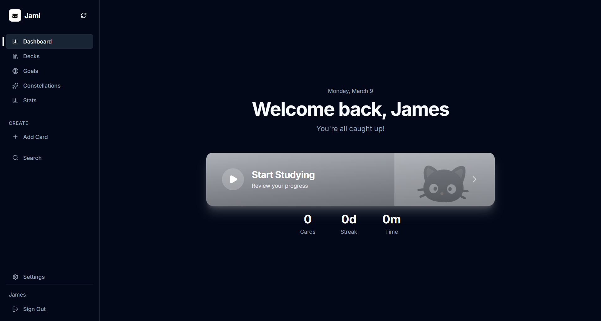

# Jami Flashcards



Jami is a modern flashcard learning platform designed to make memorisation simple, effective, and engaging.

The application allows users to create flashcards, organise them into decks, and track their learning progress through structured review sessions and goal-based rewards.

Jami aims to make studying both **efficient and enjoyable**, helping students retain knowledge through consistent review.

---

# Features

• Create and manage flashcards
• Organise flashcards into decks
• Track study progress
• Goal-based reward system using stars
• Apple authentication login
• Clean and responsive user interface

---

# Tech Stack

This project is built using a modern full-stack TypeScript architecture.

### Frontend

* React
* Vite
* TypeScript
* CSS

### Backend

* Node.js
* Express

### Database

* PostgreSQL
* Prisma ORM

---

# Project Structure

```
jami-flashcards
│
├── client/        Frontend application
├── server/        Backend API
├── prisma/        Database schema and migrations
├── script/        Utility and seed scripts
├── shared/        Shared types and utilities
├── attached_assets
│
├── package.json
├── tsconfig.json
├── vite.config.ts
└── drizzle.config.ts
```

---

# Running the Application

The application is currently developed and hosted using **Replit**.

The live version of the project runs directly from the Replit environment rather than a local development setup.

---

# Author

James

GitHub:
https://github.com/jarems421

---

# License

This project is licensed under the MIT License.
